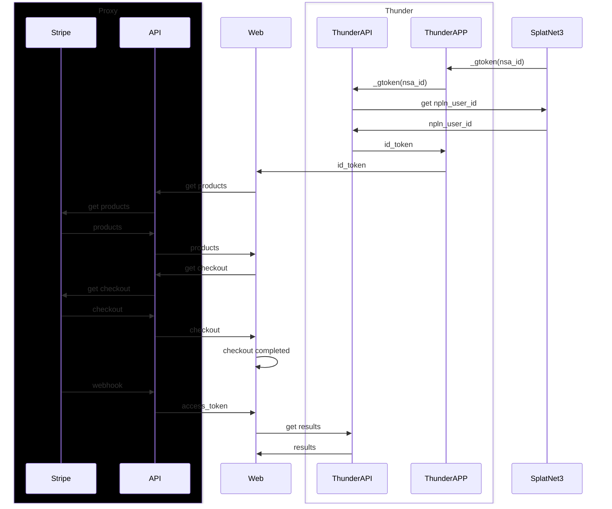

## Thunder API

スプラトゥーン3におけるイカリング3から取得できるサーモンランのJSONを送信すると, 利用しやすい形式に変換してくれるAPIです.

### 機能

- [x] `/v3/schedules`
  - BCATで配信されている最新のスケジュールまでを返します.
- [x] `/v1/weapon_records`
  - `CoopWeaponRecordQuery`のデータを受け取ってフォーマットしたJSONを返します
- [x] `/v1/records`
  - `CoopRecordQuery`のデータを受け取ってフォーマットしたJSONを返します.
- [x] `/v1/histories`
  - `CoopHistoryQuery`のデータを受け取ってフォーマットしたJSONを返します.
- [x] `/v3/results`
  - `CoopHistoryDetailQuery`と`CoopHistoryQuery`を組み合わせたデータを受け取ってフォーマットしたJSONを返します.

### フォーマット

返ってくるJSONのフォーマットです.

#### `v3/schedules`

スケジュール情報はGETリクエストのみなので送信するフォーマットはありません.

```json
[
  {
    "id": "0664e978f616079a7a4fa8e1cbc0bb00",
    "startTime": "2024-09-15T16:00:00.000Z",
    "endTime": "2024-09-17T08:00:00.000Z",
    "rareWeapons": [],
    "weaponList": [
      8000,
      230,
      4040,
      6010
    ],
    "bossId": 24,
    "stageId": 9,
    "mode": "REGULAR",
    "rule": "REGULAR"
  },
]
```

#### `/v1/histories`

`CoopHistoryQuery`のレスポンスをそのまま送信すると以下の形式のレスポンスが得られます.

```json
```

#### `/v3/results`

```json
```

#### `/v1/records`

`CoopRecordQuery`のレスポンスをそのまま送信すると以下の形式のレスポンスが得られます.

```json
{
  "stageRecords": [
    {
      "startTime": null,
      "endTime": null,
      "goldenIkuraNum": null,
      "grade": 8,
      "gradePoint": 999,
      "rank": null,
      "stageId": 2,
      "trophy": null
    }
  ],
  "enemyRecords": [
    {
      "count": 3175,
      "enemyId": 4
    },
    {
      "count": 0,
      "enemyId": 30
    }
  ],
  "assetURLs": []
}
```

`enemyRecords`にオオモノシャケとオカシラシャケの両方のデータが含まれます.

#### `/v1/weapon_records`

`CoopWeaponRecordQuery`のレスポンスをそのまま送信すると以下の形式のレスポンスが得られます.

```json
{
  "assetURLs": []
}
```

### ワークフロー

アクセストークンを付与するうえで検討すべき点.

1. ユーザーが自身のユーザーの情報に確実にアクセスできる
2. 他のユーザーの情報にはアクセスできない
3. 他のユーザーが別のユーザーになりすますことはできない
4. なりすまし等は確実に検知することができる
5. アプリ内からStripeへの導線があってはならない(App Storeのポリシー)
6. 認証に使われる`npln_user_id`と`nsa_id`は公開情報である

それを実装するためのワークフロー(仮)は以下の通り.



前提としてThunderAPPは`_gtoken`から発行される`bullet_token`を使ってSplatNet3からデータを取得してThunderAPIに送信している.
ThunderAPIは全てのリザルトを保存しているため, 本人だけのリザルト取得には認証が必要不可欠となる.
そのためにサーモンランにおけるプレイヤーのIDとなる`npln_user_id`を含むJSON Web Tokenを発行し, その署名を検証することで本人かどうかをチェックするものとする.

1. ThunderAPPはSplatNet3の通信をMITMすることで`_gtoken`を得る
    - `_gtoken`はJSON Web Tokenであるため秘密鍵なしに偽の署名をすることは不可能である上に, 真正であることの検証は公開鍵を使って行える
2. ThunderAPPはThunderAPIに`_gtoken`を送信する
3. ThunderAPIは送られた`_gtoken`の検証をし, ペイロードから`nsa_id`を取得する
4. ThunderAPIは`_gtoken`を使ってSplatNet3からデータを取得し, `npln_user_id`を得る
    - `_gtoken`は有効期限が2.5時間ほどしかない上にThunderAPIは`_gtoken`を保存しない
5. 得られた`npln_user_id`と`nsa_id`を使って`id_token`を発行し, ThunderAPIの秘密鍵を使って署名する
6. Webのフォームから`id_token`を入力する
7. 入力された`id_token`はAPIに送られ, 検証される
    - 検証をパスすれば`id_token`に含まれる`npln_user_id`と`_nsa_id`は正しいことが保証される
8. `npln_user_id`と`nsa_id`を使ってStripeのCheckoutセッションを完了させる
9. セッション後の支払いが成功すればStripeから送られるWebhookを利用して`id_token`とWebhookのペイロードから`access_token`を生成する
    - `access_token`にはサブスクリプションの状態と有効期限が入っている
    - よって`access_token`が有効であればサブスクリプションも有効である
    - 正しい顧客に正しい`nsa_id`, `npln_user_id`が含まれる`access_token`が返る

### 検討事項

- `id_token`と`access_token`はどちらもThunderAPIへのアクセス権限がある
    - 課金している人だけ制限が緩和されている感じ
- `npln_user_id`および`nsa_id`は改竄ができないかどうか
    - これら二つは公開情報であるため, 他人がなりすませないことを厳密にチェックする必要がある
    - なりすませる場合, 他人のリザルトへのアクセス権がある`id_token`および`access_token`を発行してしまうことになる
- `_gtoken`の権限の確認
    - `_gtoken`をThunderAPIに渡すのはセキュリティ上懸念事項にならないかどうか
    - `_gtoken`を本来の持ち主ではないThunderAPIからSplatNet3にリクエストを送るのはセキュリティ上の懸念事項にならないかどうか
- ThunderAPIはサーモンランNWにおけるリクエストを処理するだけのAPI, APIはStripeのProxyとして働き, 個人開発におけるサービス全般の課金情報を扱うAPIとして開発している
    - 本来のサービスから外れた処理をしていないかどうか
- Stripeにおける課金のサイクルはおよそ一ヶ月となっているが, 有効期限が一ヶ月もあるトークンを発行することに問題がないかどうか

### アクセストークン

ユーザーのデータにアクセスするためのトークンです. JSON Web Tokenで与えられ, 以下のデータを含みます.

```json
{
  "aud": "6633677291552768",
  "exp": 1729744526,
  "iat": 1727152526,
  "iss": "localhost",
  "jti": "879b8ecf-a66d-438a-a745-dcc7db6f8c15",
  "membership": true,
  "nbf": 1727152526,
  "npln_user_id": "a7grz65rxkvhfsbwmxmm",
  "nsa_id": "3f89c3791c43ea57",
  "typ": "id_token"
}
```

- `aud`
    - APIサービス名で`6633677291552768`が固定値で与えられます.
- `exp`
    - トークンの有効期限を表すUnix時間です.
- `iat`
    - トークンの発酵時間を表すUnix時間です.
- `iss`
    - トークンを発行したサーバーの識別子です.
    - 開発環境では`localhost`が返ります.
- `jti`
    - トークンの一意識別子です. UUID形式で与えられます.
- `membership`
    - Nintendo Switch Onlineのメンバーシップが有効であるかどうかの真理値.
- `sub`
    - DiscordのユーザーID
- `cus`
    - StripeのユーザーID
- `nbf`
    - トークンが有効になる時間を表すUnix時間です.
- `npln_user_id`
    - あなたのNPLNサーバーにおけるユーザーIDです.
    - この値はあなたと遊んだすべてのユーザーが確認することができる公開情報です
- `nsa_id`
    - Nintendo Service Account IDです.
    - この値はあなたとフレンドであるすべてのユーザーが確認することができる公開情報です
- `typ`
    - トークンの種類を返します
    - `id_token`または`access_token`が入ります
